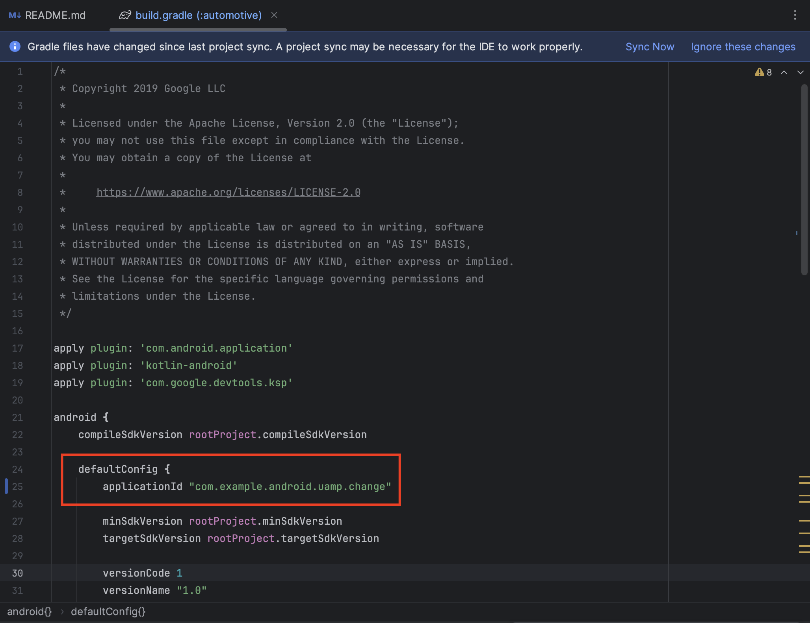
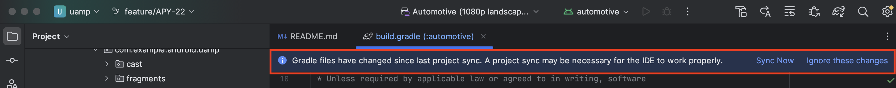

Universal Android Music Player Sample
=====================================
The goal of this sample is to show how to implement an audio media app that works
across multiple form factors and provides a consistent user experience
on Android phones, tablets, Android Auto, Android Wear, Android TV, Google Cast devices,
and with the Google Assistant. 


Pre-requisites
--------------

- Android Studio 3.x (preferably)
or
- CMD

After cloning the project, don't forget do add ```.faapriv``` to the directory of the project
When using CMD, there are some extra steps needed.
If the file “local.properties” doesn’t exist in the project, please create it and paste this line:
```sdk.dir=/Users/yourUser/Library/Android/sdk```
Modify ‘yourUser’ with the user you are currently using.
After all this, run the following command:
```gradle build -x lint -x :common:testDebugUnitTest -x :common:testReleaseUnitTest```

Changing the package name
---------------

In order to change the package, for testing purposes, you need to change the ApplicationId of the desired platform.
- For mobile: [build.gradle](/app/build.gradle)
- For media: [build.gradle](/media/build.gradle)
- For poi: [build.gradle](/poi/build.gradle)
- For navigation: [build.gradle](/navigation/build.gradle)
- For parking: [build.gradle](/parking/build.gradle)
- For charging: [build.gradle](/charging/build.gradle)

After locating the desired build.gradle, find the ```defaultConfig``` and change the ```applicationId``` for the desired package.

After this, you need to sync. If you are making changes in AndroidStudio, there will be a blue banner asking you to sync. Like this:

Press "sync now" and wait until it completes.
If you are making changes in another IDE or Text editor, open a terminal, ```cd``` into the project folder and run the command ```gradle sync```.


Building an APK
---------------

The easiest way of building an APK is as follows:

- Open a terminal and ```cd``` into the project folder
- Depending on the type of APK that you want:
  - For debug, run the command: 
    - mobile -> ```gradle app:assembleDebug``` 
    - media -> ```gradle media:assembleDebug```
    - poi -> ```gradle poi:assembleDebug```
    - navigation -> ```gradle navigation:assembleDebug```
    - parking -> ```gradle parking:assembleDebug```
    - charging -> ```gradle charging:assembleDebug```
  - For release, run the command: 
    - mobile -> ```gradle automotive:assembleRelease```
    - media -> ```gradle media:assembleRelease```
    - poi -> ```gradle poi:assembleRelease```
    - navigation -> ```gradle navigation:assembleRelease```
    - parking -> ```gradle parking:assembleRelease```
    - charging -> ```gradle charging:assembleRelease```

Wait for the command to complete.

Once it's done, you can find the APKs inside this folders:
- [Mobile, debug](/app/build/outputs/apk/debug)
- [Mobile, release](/app/build/outputs/apk/release)
- [Media, debug](/media/build/outputs/apk/debug)
- [Media, release](/media/build/outputs/apk/release)
- [Poi, debug](/poi/build/outputs/apk/debug)
- [Poi, release](/poi/build/outputs/apk/release)
- [Navigation, debug](/navigation/build/outputs/apk/debug)
- [Navigation, release](/navigation/build/outputs/apk/release)
- [Parking, debug](/parking/build/outputs/apk/debug)
- [Parking, release](/parking/build/outputs/apk/release)
- [Charging, debug](/charging/build/outputs/apk/debug)
- [Charging, release](/charging/build/outputs/apk/release)

If for some reason it doesn't work, run the command ```gradle clean```.
If you are using Android Studio, after the clean do "Invalidate caches and restart" from the "File" menu.

License
-------

Copyright 2017 Google Inc.

Licensed to the Apache Software Foundation (ASF) under one or more contributor
license agreements.  See the NOTICE file distributed with this work for
additional information regarding copyright ownership.  The ASF licenses this
file to you under the Apache License, Version 2.0 (the "License"); you may not
use this file except in compliance with the License.  You may obtain a copy of
the License at

  http://www.apache.org/licenses/LICENSE-2.0

Unless required by applicable law or agreed to in writing, software
distributed under the License is distributed on an "AS IS" BASIS, WITHOUT
WARRANTIES OR CONDITIONS OF ANY KIND, either express or implied.  See the
License for the specific language governing permissions and limitations under
the License.
